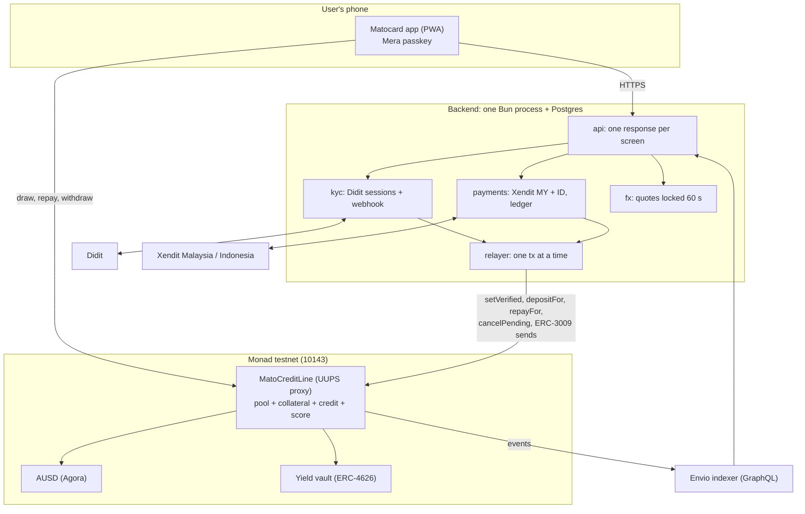

## Components

| Component | Where | Job |
|---|---|---|
| **App** | `apps/app` (in progress), Next.js PWA | Screens, passkey account, the user's own contract calls |
| **Backend** | [`apps/backend`](https://github.com/matocard/matocard/tree/main/apps/backend), Bun + Postgres, Docker | API, KYC, payments, FX, relayer, reconciliation |
| **Contracts** | [`contracts`](https://github.com/matocard/matocard/tree/main/contracts), Foundry | `MatoCreditLine` and its modules, the scoring library |
| **Indexer** | [`apps/indexer`](https://github.com/matocard/matocard/tree/main/apps/indexer), Envio HyperIndex | History, public record, daily totals |
| **Shared packages** | `packages/contracts`, `packages/core` | ABIs, addresses, gas limits; money helpers |
| **Landing** | [`apps/landing`](https://github.com/matocard/matocard/tree/main/apps/landing), Next.js | matocard.xyz |

## Design decisions

| Decision | Why |
|---|---|
| AUSD is the only onchain unit | Collateral and debt in one currency: no oracle, no FX in the contract |
| FX offchain, locked per quote | Keeps the contract simple and verifiable |
| Invisible account: passkey, plus a MON drip after KYC | No seed phrase, no gas to buy. A drip is cheaper than a paymaster on Monad |
| One identity, one account, in the contract | Otherwise a defaulter starts over |
| Card hold enforced by the contract | The relayer cannot shorten it |
| Collateral as ERC-4626 shares | Collateral grows; value read without an oracle |
| Default seizes shares, not assets | Instant even when the vault queues withdrawals |
| Interest-free; the protocol keeps 20% of collateral yield | Clear business model; friendly to borrowers who avoid interest |
| One UUPS proxy built from modules, ERC-7201 storage | One address for everyone; modules upgrade without shifting each other |
| Plain sends use AUSD's ERC-3009 | One signature, no approval, no gas for the sender |
| Webhooks record, a worker acts | A slow chain never times out a webhook; crashes resume |

## Contract modules

| Module | Responsibility |
|---|---|
| `Governed` | Roles, pause, parameters, upgrade authorisation; two-step admin handover with a one-day delay |
| `PoolModule` | ERC-4626 pool over AUSD for lenders |
| `IdentityModule` | One verified identity per wallet, both ways |
| `CollateralModule` | Collateral as vault shares, card hold, chargeback reversal, yield fee |
| `CreditModule` | Draw, repay, default, score and limit |
| `CreditScoring` | Pure library: score, ratio, limit |
