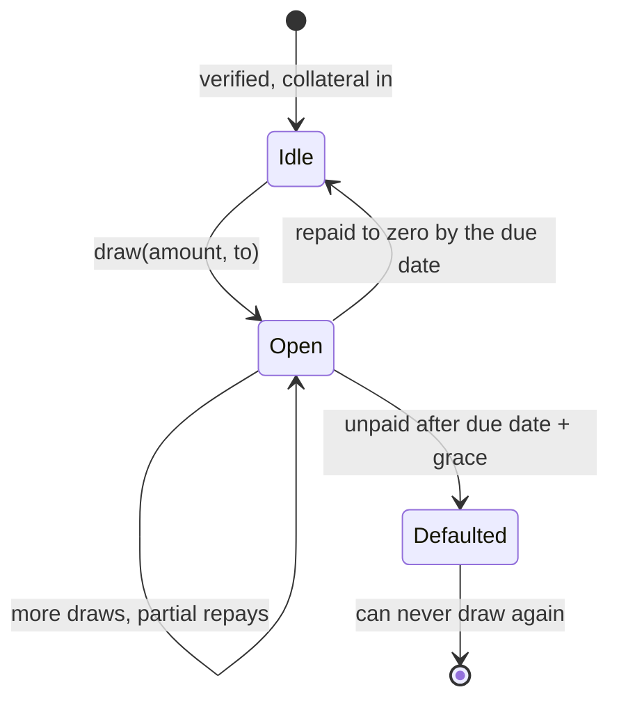

Matocard is one smart contract, `MatoCreditLine`, holding three things:

1. **Borrowers' collateral**, as shares of a yield vault.
2. **Lenders' AUSD**, in a pool that funds every draw.
3. **Each borrower's record**: debt, due date, cycles, score.

## The lifecycle of a cycle



- **Draw.** A verified borrower draws AUSD up to their available credit, to any address: their own, a family member's, a merchant's. The first draw of a cycle fixes its due date (30 days) and the rules it will be judged by.
- **Repay.** Repaying to zero closes the cycle. If it qualifies, the score goes up. Repaying more than is owed is capped, not refused.
- **Default.** If the debt is still open after the due date and the grace period, anyone may call `markDefaulted`. See [Defaults](/learn/defaults).

## Your limit

```
limit = collateral value ÷ collateral ratio
```

- **Collateral value** is what your vault shares are worth now, net of the yield fee.
- **Collateral ratio** falls as your score rises: 150% at score 0, 80% at score 100.

So the limit rises two ways: when your collateral earns yield, and when your score goes up. The [Credit score](/learn/credit-score) page has the full formula.

## What the contract guarantees

- Your debt can never exceed your limit after a draw or a withdrawal.
- Collateral still in a card hold never counts toward the limit.
- Repaying is never paused, so nobody is defaulted for want of a way to pay.
- One identity can never be bound to two accounts.

Each is covered by unit tests, alongside invariant tests over random activity. See [Security](/learn/security).
