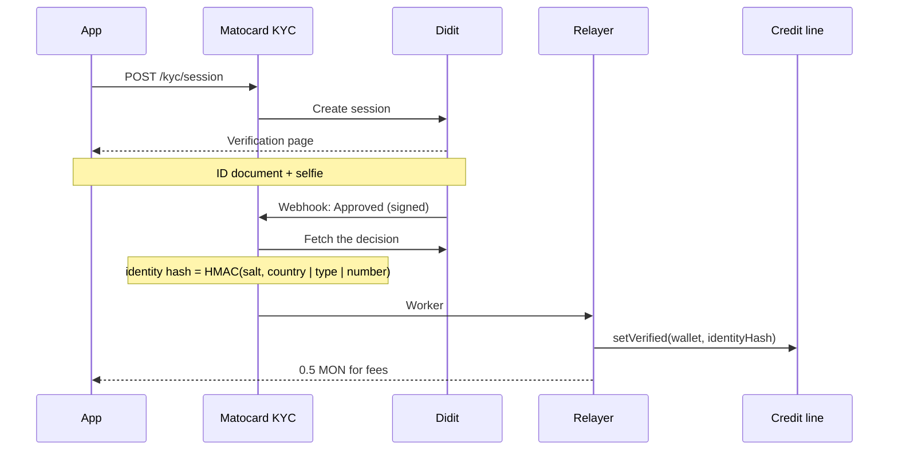

## Why it exists

A credit score only means something if a defaulter cannot walk away and open a fresh account. So Matocard binds **one identity to one account, permanently**, in the contract.

## The flow

1. The webhook is checked with an HMAC signature over the raw body and must be less than 5 minutes old.
2. The webhook only says *approved*; the backend fetches the decision from Didit itself for the document.
3. The **identity hash** is an HMAC, keyed with a server secret, over the document's issuing country, type and number, normalised. The key means nobody can brute-force a hash back into a document number.
4. If the hash is already bound to another account, the result is **duplicate**, both in the database and, as a backstop, in the contract.
5. Once `setVerified` is confirmed onchain, the account receives a one-time MON drip for network fees.

<Frame caption="Didit's verification page opened from Matocard: ID document, then a selfie. On a computer it shows a QR code to continue on a phone.">
  
</Frame>

## What is stored where

| Where | What |
|---|---|
| Monad | `identityHash ↔ wallet`, and `isVerified` |
| Matocard database | The status (`pending`, `approved`, `rejected`, `duplicate`) and the hash |
| Didit | The document images and selfie, under Didit's data policy |

No name, document number or photo is ever written onchain or shown on the public record.

## The source of truth

The app and the API gate top-ups and sends on the **contract's** `isVerified`, not on the database row. Accounts verified onchain by other means count; a database row alone does not.

## Limits of this design

- The bound is **permanent**: no unbinding, no rebinding. A lost passkey today means a lost account; a timelocked recovery that rebinds a verified identity is on the [roadmap](/overview/roadmap).
- Matocard and Didit are trusted to verify honestly. See [Trust model](/learn/trust-model).
