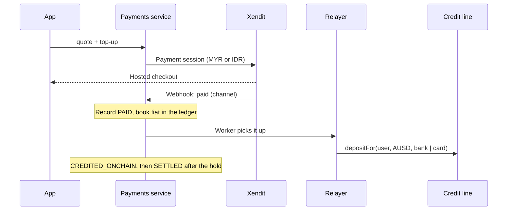

Fiat moves through **Xendit**, with one account per country, because Xendit ties an account to the country it is registered in.

| Xendit account | Collects | Pays out | Methods |
|---|---|---|---|
| **Malaysia** | MYR | No | FPX, DuitNow QR, cards |
| **Indonesia** | IDR | **Every cash-out**, in IDR | Virtual accounts, QRIS, cards, e-wallets |

The app picks the account by asking for a quote in the user's currency: `USD/MYR` for Malaysia, `USD/IDR` otherwise. Cash-outs always go through Indonesia, where the families are.

What the user sees after choosing to top up:

<Tabs>
  <Tab title="Malaysia (MYR)">
<Frame caption="Xendit Malaysia checkout for a RM 50 top-up, test mode.">
  
</Frame>
  </Tab>
  <Tab title="Indonesia (IDR)">
<Frame caption="Xendit Indonesia checkout for a Rp 100,000 top-up, test mode.">
  
</Frame>
  </Tab>
</Tabs>

## Money in

1. The webhook only **records** what happened and answers at once.
2. A worker in the same process does the onchain part, one transaction at a time. A crash between the two halves leaves a `PAID` payment that the next run picks up.
3. The method passed to the contract comes from the **channel Xendit reports**, not what the user picked. See [Card hold](/learn/card-hold).

## Money out

1. The user signs an AUSD transfer to Matocard's treasury (ERC-3009, no gas for them).
2. The relayer submits it, taking the AUSD.
3. Xendit pays the rupiah to the bank, with the payout ID as the idempotency key so a retry can never pay twice.

## Settlements

A settlement charges the whole debt in local money, rounded up. Once paid, the relayer calls `repayFor`, which closes the cycle exactly as if the borrower had repaid onchain.

## Refunds and chargebacks

| When | What happens |
|---|---|
| Inside the card hold | The deposit is taken back onchain with `cancelPending`. The limit never counted it |
| After the hold | Booked as the **operator's** loss, never the lenders' |

## Safety rules

- Every webhook is verified (Xendit callback token) and processed **once**.
- A payment only moves `PENDING → PAID → CREDITED_ONCHAIN → SETTLED | REVERSED` (or `PENDING → FAILED`); the database refuses any other step and logs every one.
- The ledger is double-entry and append-only; each currency balances.
- Daily caps on what the relayer may credit: 1,000 AUSD per user, 20,000 AUSD in total.
- Every day's credited top-ups are [reconciled](/developers/operations) against the indexer.

## In production

Agora's **Routes API** would mint and redeem AUSD directly against fiat at the issuer, replacing Matocard's own treasury float. It needs an Agora organisation account and is on the [roadmap](/overview/roadmap).
