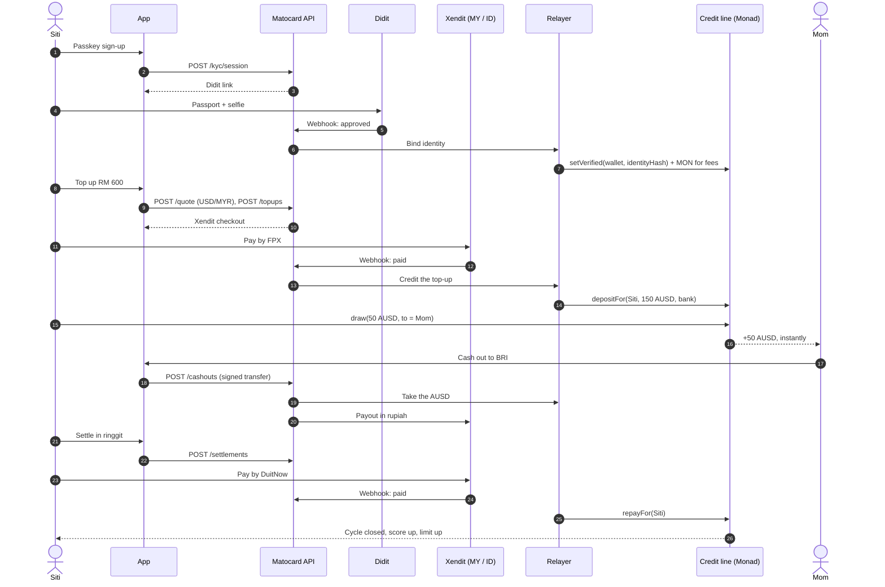

Amounts assume 1 USD = 4.00 MYR = 16,000 IDR for readability. The app uses the live rate.

## The journey

<Steps>
  <Step title="Siti signs up">
    Fingerprint or Face ID creates her account. She picks Malaysia as where she lives.
  </Step>
  <Step title="She verifies her identity">
    A photo of her passport and a selfie, checked by Didit. Matocard then gives her account a little MON for network fees, invisibly.
  </Step>
  <Step title="She tops up RM 600">
    By debit card, FPX online banking or DuitNow QR. A card payment is held briefly against chargebacks; a bank or QR payment counts at once.
  </Step>
  <Step title="Her home screen">
    Collateral 150.00 AUSD (≈ RM 600), score 0, ratio 150%, **available credit 100.00 AUSD (≈ RM 400)**, and why: collateral, score and ratio side by side.
  </Step>
  <Step title="She sends Rp 800,000 to her mother">
    About 50 AUSD at a rate locked for 60 seconds. The draw goes straight to her mother's Matocard and settles in under a second. Her mother taps **Cash out to BRI** and receives rupiah in her bank account.
  </Step>
  <Step title="Payday: she settles">
    She pays the whole balance in ringgit by FPX or DuitNow, or deducts it from her collateral. Her score goes up, her limit goes up, and the app shows what changed.
  </Step>
  <Step title="Anyone can check her record">
    Her public page shows her score, settled cycles and history, with no personal data. A bank in Indonesia can still read it when she moves home.
  </Step>
</Steps>

<Frame caption="Home screen in the Matocard app. Placeholder until the app ships.">
  
</Frame>

## Behind the screens

## Two people, two currencies

| | Siti (sender) | Her mother (receiver) |
|---|---|---|
| Lives in | Malaysia | Indonesia |
| Pays in with | Ringgit: FPX, DuitNow QR, card | Not needed |
| Receives | Credit, in AUSD | AUSD from Siti, instantly |
| Cashes out to | Not needed | Her Indonesian bank, in rupiah |
| Signs up with | Passkey + ID check | Passkey + ID check |

Every receive is also an invitation: the family installs Matocard to cash out, and the next sender hears about it from them.
